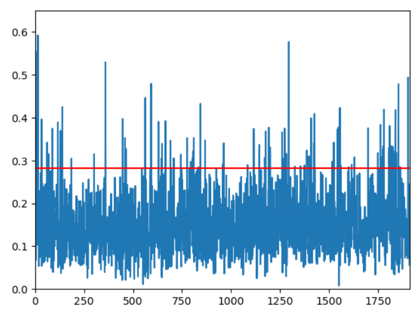

# Generating an ORPO Dataset using LLMs

This repository contains scripts for generating data for training LLMs. The project includes the following components:

- **LLM.ipynb**: A notebook for language model operations.
- **text_cleaning**: A folder containing:
  - **Text_cleaning_full.ipynb**: A notebook for full text cleaning processes.
  - **visualisation.ipynb**: A notebook for visualizing text data.
  - **Badwords.xlsx**: A file containing a list of bad words for filtering.
- **output**: A folder where processed files and results will be saved.
- **input**: A folder where you should place your input files.
- **img**: A folder containing images used in the README or generated by the notebooks.

## Table of Contents
- [Installation](#installation)
- [Usage](#usage)
- [Notebooks and Their Functions](#notebooks-and-their-functions)
- [Input and Output Folders](#input-and-output-folders)
- [Example](#example)
- [Contributing](#contributing)
- [License](#license)
- [Images](#images)

## Installation

1. Clone the repository:
    ```sh
    git clone https://github.com/gp2001/Thesis_LLM_Stater_NV.git
    ```
2. Navigate to the project directory:
    ```sh
    cd Thesis_LLM_Stater_NV
    ```
3. Install the required packages:
    Each notebook begins with downloading the packages and setting a hf_token.

## Usage

### Running the Notebooks

You can run the Jupyter notebooks using Jupyter Lab or Jupyter Notebook. To start Jupyter Lab, use the following command:
```sh
jupyter lab
```
Open each notebook (`LLM.ipynb`, `Text_cleaning_full.ipynb`, `visualisation.ipynb`) in Jupyter Lab and execute the cells sequentially.

## Huggingface Token
For running the language model operations in LLM.ipynb, you need to enter your Huggingface token. Make sure to have your token ready and follow the instructions in the notebook to input it.

## Notebooks and Their Functions

### 1. LLM.ipynb
This notebook contains the code for language model operations. Follow the steps below:

- **Load the required packages**: Execute the cell that imports necessary libraries.
- **Load and preprocess data**: Ensure your input data is in the correct format and load it using the provided code.
- **Run language model operations**: Follow the instructions within the notebook to execute language model tasks.
- **Save the results**: The output will be saved in the specified output folder.

> **Note:** To use the code for all text files, first run `Text_cleaning_full.ipynb` notebook. Then manually place the generated text files in the `input/textfiles` folder. Expanding the template prompts can be easily done by adding them to the input/prompts folder, naming them appropriately, and ensuring they are in the correct ascending format.


#### Example Output
Here is a glimpse of the first few rows of the `.parquet` file generated by `LLM.ipynb`:

| chosen                                                                                                                                                                                                                                                                                                                                                                                                           | rejected                                                                                                                                                                                                                                                                                                                                                                                                        | prompt                                                                                | question                                                                            |
|------------------------------------------------------------------------------------------------------------------------------------------------------------------------------------------------------------------------------------------------------------------------------------------------------------------------------------------------------------------------------------------------------------------|----------------------------------------------------------------------------------------------------------------------------------------------------------------------------------------------------------------------------------------------------------------------------------------------------------------------------------------------------------------------------------------------------------------|---------------------------------------------------------------------------------------|-------------------------------------------------------------------------------------|
| [{'content': 'Kunt u samenvatten wat de algemene erfpachtvoorwaarden van de gemeente Venlo betreffen?', 'role': 'user'} {'content': 'De algemene erfpachtvoorwaarden van de gemeente Venlo regelen de uitgifte van industrieterrein in erfpacht. Het betreft de verhouding tussen de gemeente als erfpachter en de erfpachter. De voorwaarden behandelen onderwerpen als de canon, de grondprijs, de rente, de situatieschets, de duur van het recht, de opzegging en de waardevergoeding. De voorwaarden zijn van toepassing op elke erfpachtovereenkomst tussen de gemeente en de erfpachter.', 'role': 'assistant'}] | [{'content': 'Kunt u samenvatten wat de algemene erfpachtvoorwaarden van de gemeente Venlo betreffen?', 'role': 'user'} {'content': 'De algemene erfpachtvoorwaarden van de gemeente Venlo zijn een document dat de gemeente gebruikt om erfpacht te verstrekken aan bedrijven. Het document behandelt onderwerpen als de canon, de grondprijs, de rente en de duur van het recht. De voorwaarden zijn belangrijk om te weten omdat ze bepalen hoe de erfpacht wordt uitgevoerd en wat de rechten en plichten zijn van de partijen.', 'role': 'assistant'}] | Kunt u samenvatten wat de algemene erfpachtvoorwaarden van de gemeente Venlo betreffen? | Kunt u samenvatten wat de algemene erfpachtvoorwaarden van de gemeente Venlo betreffen? |

### 2. Text_cleaning_full.ipynb
This notebook handles full text cleaning processes. Follow these steps:

- **Load the required packages**: Execute the cell that imports necessary libraries.
- **Load the input data**: Place all data folder parts in the `input/data_folder` folder and load it using the provided code.
- **Text cleaning operations**: Follow the instructions within the notebook to perform text cleaning.
- **Save cleaned data**: The cleaned text data will be saved in the `input/textfiles` folder and the other insights in the same `\text_cleaning` folder.

### 3. visualisation.ipynb
This notebook is for visualizing text data. Follow these steps:

- **Load the required packages**: Execute the cell that imports necessary libraries.
- **Load the input data**: Place all data folder parts in the `input/data_folder` folder and load it using the provided code.
- **Generate visualizations**: Follow the instructions to create visualizations of the text data.
- **Save visualizations**: The visualizations will be shown directly and an image is saved in the `img` folder.

## Input and Output Folders

- **Input Folder**: This folder contains the input files required for processing. Ensure you place the necessary files in this directory before running the scripts.
- **Output Folder**: The processed files and results will be saved in this folder. Check this directory for outputs after running the notebooks.

## Example

1. Place all parts of the data folders in `input/data_folder` (e.g `input/data_folder/part1`, `input/data_folder/part2` ... `input/data_folder/part6`).
2. Use `visualisation.ipynb` to generate visualizations based on the initial data.
3. Open `Text_cleaning_full.ipynb` and run all cells to clean the text data, The cleaned data will be saved in the `input/textfiles` folder.
4. Use `LLM.ipynb` to produce an ORPO Dataset which will be available in `output/output.parquet`. One could adjust the parameter to produce a well balanced dataset.
5. Evaluate the dataset using the evaluation methods in `LLM.ipynb`. This will provide more insights about the data and will clean it once more, the cleaned data will be in `output/filtered_output.parquet`.
> **Note:** This project already contains some `textfiles` and an `output/output.parquet`. These are provided so that one could immediately perform the LLM generation without going through the data cleaning step, also one can do the evaluation without going through the LLM generation. This is not the complete dataset, so if one wants to process the entire dataset, they should start from step 3 (data cleaning), followed by LLM generation, and then evaluation again. In this case, ensure that the `input/textfiles` folder is empty and that `output/output.parquet` file is deleted before proceeding.

## Contributing

This project was contributed to by Gabriël Shamon, Tommy Smits, and Daan Seijnaeve. The project was carried out in cooperation with Stater NV and University of Utrecht.

## License

This project is proprietary and confidential. Unauthorized copying, distribution, or use of this project, in whole or in part, is strictly prohibited without the express permission of Stater NV.

For any inquiries regarding licensing, please contact Stater NV.

©2024 Stater NV. All rights reserved.

## Images

### Example Visualization

Here is an example visualization generated by `visualisation.ipynb`:


